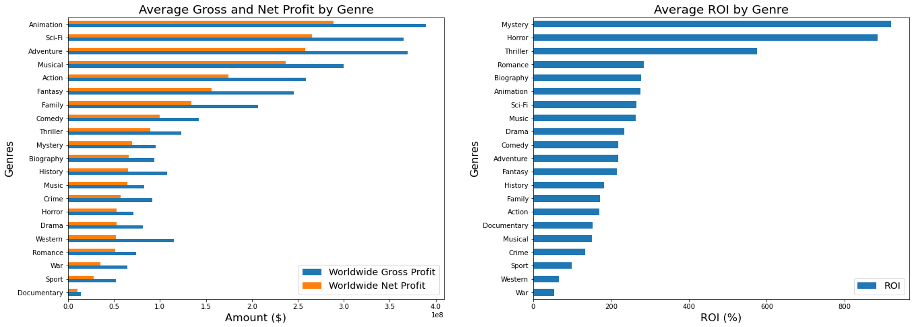

# Microsoft Movie Analysis

**Author:** Benjamin Toler

## Overiview
This project uses exploratory data anlysis to produce insights about the movie industry. Analysis of a movie datasets from IMBD and The Numbers shows that the most profitable movies are those that use large production budgets, are of the animation, SciFi, or Adventure genres, and are realeased during the summer or holiday months. These insights can be used by Microsoft to guide the decision making in their new movie business.

## Business Problem
Microsoft is planning on starting their own movie studio, but they are lacking industry knowledge. Analysis of the movie elements that lead to success at the box office could help Microsoft's new studio make decisions about the types of movie they want to produce.

## Data
This project uses datesets from IMBD and The Numbers. The IMDB dataset conatains information on various movie attributes, including region of production, genre, and ratings. Each movie also has a unique ID, making the joining of different IMDB datesets easy. The Numbers provides data on movie release dates and  movie financials such as budget and gross profit.

## Method
The analysis deployed in this project includes using summary statistics for grouped categorcial data and correlations between numeric data. This generates and overall picture of what are the most profitable types of movies.

## Results
Animation, sci-fi, and adventure genres produce the greatest average gross and net profit, however mystery and horror movies provide the best average return on investment.
 

The summer months of May, June, and July see the highest profits for movies. There also a significant spike in movie profits at the beginning of the holiday season in November

Production budget is most strongly correlated with profits and has a weaker positive correlation with movie ratings. There is no correlation between a movie's budget and its return on investment.

## Conclusions
 - **Invest in large budget movies in the anmiation, sci-fi, and adventrue genres:** Micrsoft is a multi-trillion dollar company. For their new movie studio to have a susbtantial impact they will need genereate sizable profits. This is most likely to occur in large budget productions in the animation, sci-fi, and adventure generes.
 - **Fill out movie catalogue with lower budget mystery and horror films:** While the primary focus should be on big budget movies, lower budget mystery and horror movies offer a strogner retrun on investment and can help fill out the new studio's movie collection.
 - **Release new movies during the summer and holiday months:** May, June, and July are the prime months for releasing new movies as schools are starting to close and people are taking time off. Aditionally, the beginning of the the holiday season in Novmber offers a good opporutinty for movie releases.

## Next Steps
 - **Determine what factors impact ratings:** The analysis conducted revealed the effects of several movie elements on profits and ROI; however, each of thos elements showed no substanital effect on ratings. Future analysis should focus on identifying movie attributes to impact ratings.
 - **Explore the impact of cast and crew on movie success:** This analysis could identify which cast and crew positions (i.e directors, actors, writers) are most crucial to the the success of a movie.
 - **Analyze the influence that streaming platforms have had on box office returns:** In recent years, streaming platforms have become more prevelant. Looking at the overall trend of box office gross profits could lend insight into the impact streaming has had on the movie industry.

