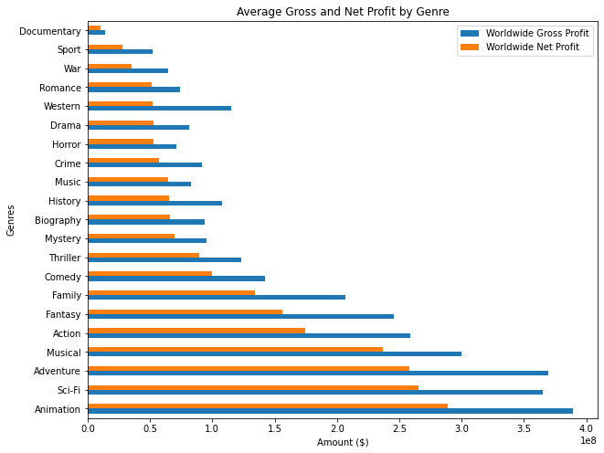
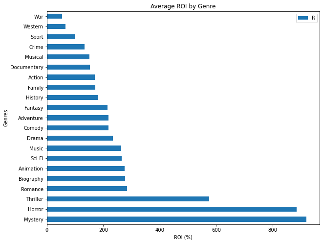
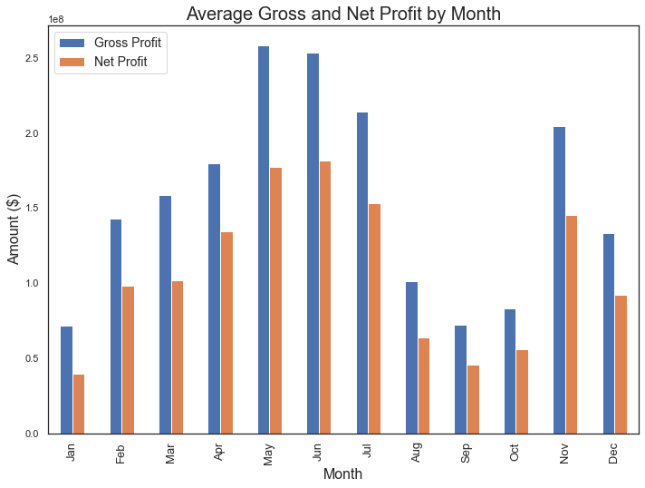
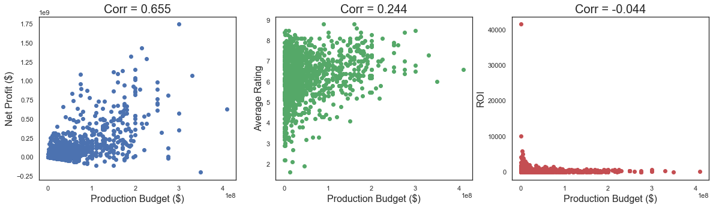

# Microsoft Movie Analysis

**Author:** Benjamin Toler

## Overiview
This project uses exploratory data anlysis to produce insights about the movie industry. Analysis of a movie datasets from IMBD and The Numbers shows that the most profitable movies are those that use large production budgets, are of the animation, SciFi, or Adventure genres, and are realeased during the summer or holiday months. These insights can be used by Microsoft to guide the decision making in their new movie business.

## Business Problem
Microsoft is planning on starting their own movie studio, but they are lacking industry knowledge. Analysis of the movie elements that lead to success at the box office could help Microsoft's new studio make decisions about the types of movie they want to produce.

## Data
This project uses datesets from IMBD and The Numbers. The IMDB dataset conatains information on various movie attributes, including region of production, genre, and ratings. Each movie also has a unique ID, making the joining of different IMDB datesets easy. The Numbers provides data on movie release dates and  movie financials such as budget and gross profit.

## Method
The analysis deployed in this project includes using summary statistics for grouped categorcial data and correlations between numeric data. This generates and overall picture of what are the most profitable types of movies.

## Results

 | 

## Conclusions

