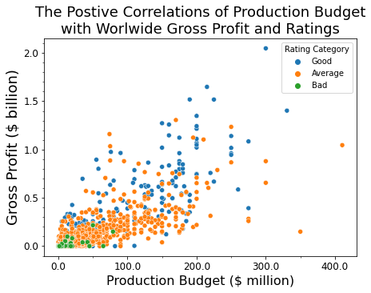
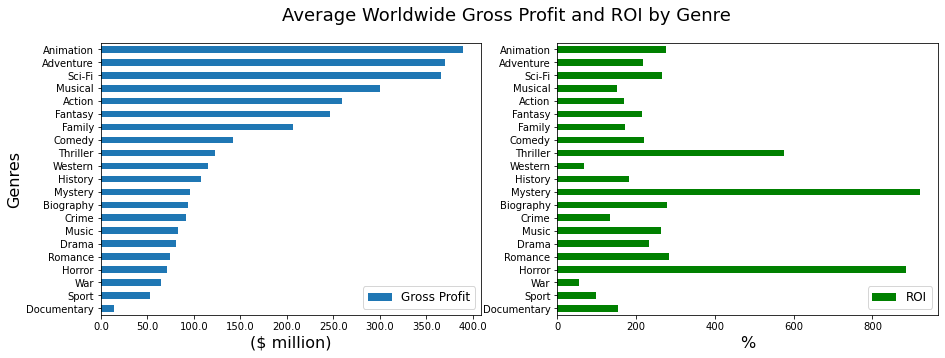
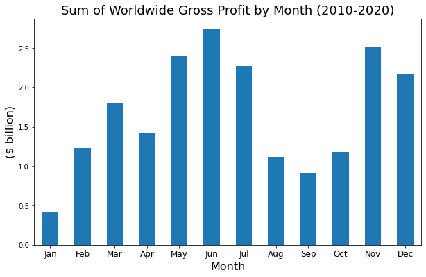

# Microsoft Movie Analysis


**Author:** Benjamin Toler

## Overiview
This project uses exploratory data analysis to produce insights about what factors lead to a movie's success. Analysis of movie datasets from IMDb and The Numbers shows that production budget, genre, and release date play an important role in determining a movie's gross profit, rating, and return on investment. Microsoft can use this analysis to determine what types of movies to make, how much to invest in them, and when to release them.

## Business Problem
Microsoft is planning on starting their own movie studio, but they are lacking industry knowledge. To guide their decision making in their new studio, they need analysis of what types of movies perform well at the box office.

## Data
This project uses datasets from IMBD and The Numbers. The IMDb dataset contains information on various movie attributes, including region of production and genre. IMDb includes movies from 2010 and after, each with their own unique ID. The Numbers provides data on release dates and  movie financials from movies between 1915 to 2020.

## Method
The analysis deployed in this project uses trending and summary statistics to evaluate the impact of various elements on a movie's success. Success is measured by a movie's worldwide gross profit, return on investment, adn/or rating (ROI).

## Results
Production budget is psotively correlated with worldwide gross profits and ratings.



Animation, sci-fi, and adventure genres produce the highest worldwide gross profits on average. Mystery and horror movies provide the best return on investment.



The summer months from May to July and the holiday months from November to December have seen the greatest sum of worldwide gross profits in the last decade.



## Conclusions
 - **Invest in large budget movies in the animation, sci-fi, and adventure genres:** Larger budget movies produce higher profits and ratings. Animation, sci-fi, and adventure genres perform better than average in terms of gross profits.
 - **Fill out movie collection with lower budget mystery and horror films:** In addition to big budget movies, Microsoft will need to fill out its movie portfolio. Lower budget mystery and horror movies offer a great opportunity to do this as they can generate a substantial return on investment.
 - **Release new movies during the summer and holiday months:** May through July and November through December are the prime months for releasing new movies as people are taking time off for the summer and holidays.

## Next Steps
 - **Determine other factors impact ratings:** Most of this analysis focused on movie features that primarily effected profits. Future modeling should identifier factors that effect movie rating.
 - **Explore the impact of cast and crew on movie success:** This analysis could identify which cast and crew positions (e.g. directors, actors, writers) are most crucial to the the success of a movie.
 - **Analyze the influence that streaming platforms have had on box office returns:** In recent years, streaming platforms have become more prevalent. Looking at the overall trend of box office gross profits could lend insight into the impact streaming has had on the movie industry.

## For More Information

See the full analysis in the [Jupyter Notebook](./Movie_Data_Analysis_for_Microsoft.ipynb) or review this [presentation](./presentation.pdf).

For additional info, contact Benjamin Toler at [bentoler22@gmail.com](mailto:alison.bentoler22@gmail.com)

## Repository Structure

```
├── images
├── zippedData
├── .canvas
├── .gitignore
├── CONTRIBUTING.md
├── LICENSE.md
├── README.md
├── presentation.pdf
└── Movie_Data_Analysis_for_Microsoft.ipynb
```
